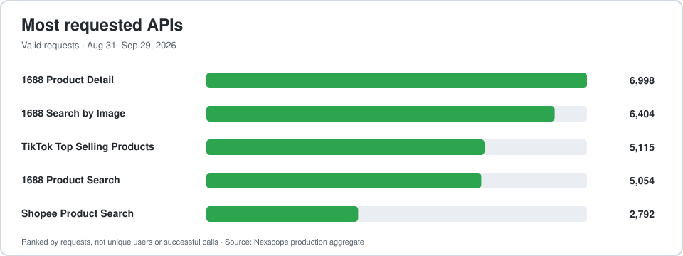

# Nexscope Ecommerce AI Tools

Practical ecommerce research, SEO, creative AI, and API workflows from the Nexscope team. This repository is a public library of guides, dated evidence, examples, and support resources for sellers and developers. The hosted Nexscope application runs separately; its source code is not in this repository.

[Explore the learning hub](https://learn.nexscope.ai/ecommerce-ai-tools/) · [Try Nexscope tools](https://www.nexscope.ai/data?utm_source=github&utm_medium=referral&utm_campaign=ecommerce_ai_tools&utm_content=readme_header) · [Browse API docs](https://www.nexscope.ai/api-docs?utm_source=github&utm_medium=referral&utm_campaign=api_docs_launch&utm_content=readme_header) · [Ask the community](https://github.com/nexscope-ai/ecommerce-ai-tools/discussions)

New users receive 1,000 free credits to get started. [Create an account](https://www.nexscope.ai/?utm_source=github&utm_medium=referral&utm_campaign=tools_launch&utm_content=readme_header). Credit use and API access vary by action and account.

## Product Gallery: get feedback on your product page

[Nexscope Product Gallery](https://learn.nexscope.ai/ecommerce-ai-tools/product-showcase/) gives sellers another public place to present a product and receive editorial suggestions. Submit a public product URL or Amazon ASIN, product details, and images; video is optional. The Nexscope team reviews submissions before publication and suggests improvements to positioning, product details, visuals, video, or destination links based on the public material provided.

**[Submit a product for review](https://learn.nexscope.ai/ecommerce-ai-tools/product-showcase/submit/?utm_source=github&utm_medium=referral&utm_campaign=product_gallery_launch&utm_content=readme_first_module)** · [Browse the Gallery](https://learn.nexscope.ai/ecommerce-ai-tools/product-showcase/) · [Discuss the workflow](https://github.com/nexscope-ai/ecommerce-ai-tools/discussions/16)

No store connection, seller token, or payment access is required. Submissions remain offline until reviewed and approved. Publication, search rankings, traffic, and sales are not guaranteed.

## About Nexscope

Nexscope helps ecommerce teams research marketplaces, analyze customer feedback, improve listings and search visibility, create product images and videos, and connect data to their own applications or AI agents through REST APIs and MCP. Sellers can use the browser tools; developers can inspect endpoint schemas, examples, and access requirements in the [API documentation](https://www.nexscope.ai/api-docs).

### Production usage snapshot

| Metric | Value | Measurement |
| --- | ---: | --- |
| Valid registered accounts | **4,267** | As of September 30, 2026; test and deleted accounts excluded |
| Average valid API requests per day | **1,316** | August 31–September 29, 2026 (30 complete days) |
| Valid API requests in the period | **39,478** | Same 30-day period |

| Most requested API | Requests in 30 days |
| --- | ---: |
| 1688 Product Detail | 6,998 |
| 1688 Search by Image | 6,404 |
| TikTok Top Selling Products | 5,115 |
| 1688 Product Search | 5,054 |
| Shopee Product Search | 2,792 |

Source: Nexscope production user records and API usage aggregates. API figures exclude test and deleted users, bots, and internal traffic. The charts count requests, including unsuccessful attempts; they do not count unique API users. This is a dated snapshot, not a live counter. The September 29 request spike is included in the 30-day average.

## Try the browser tools

| Tool | Use it to | Open |
| --- | --- | --- |
| Amazon Review Analyzer | Group complaints and form testable product-improvement hypotheses. | [Analyze reviews](https://www.nexscope.ai/tools/amazon-review-analyzer) |
| SEO Keyword Planner | Research competitor keywords, search demand, and SERP evidence. | [Plan keywords](https://www.nexscope.ai/tools/seo-keyword-planner) |
| Website SEO Auditor | Check crawlability, metadata, headings, links, and page-level SEO issues. | [Audit a page](https://www.nexscope.ai/tools/website-seo-auditor) |
| AI Amazon Listing Optimizer | Audit an ASIN and prioritize evidence-based listing changes. | [Review a listing](https://www.nexscope.ai/tools/amazon-listing-optimization-tool) |
| AI Product Image Generator | Generate or edit ecommerce images and check product accuracy. | [Create an image](https://www.nexscope.ai/tools/ai-image-generator) |
| AI Video Generator | Turn product images into videos with selectable models. | [Create a video](https://www.nexscope.ai/tools/ai-video-generator) |

## Guides and evidence

| Question | Start with |
| --- | --- |
| How can I analyze negative Amazon reviews and find product improvements? | [Review analysis guide](docs/guides/amazon-negative-review-analysis.md) and [dated case study](docs/case-studies/amazon-review-case-study.md) |
| How can I research competitor keywords? | [Amazon competitor keyword workflow](docs/guides/amazon-competitor-keyword-research.md) |
| How can I audit an ecommerce product page? | [Website SEO audit guide](docs/guides/website-seo-audit-guide.md) |
| How can I optimize an Amazon listing with evidence? | [Listing optimization guide](docs/guides/amazon-listing-optimization-tool.md) |
| How can I create accurate product images or videos? | [Image guide](docs/guides/ai-product-image-generator.md) · [Video guide](docs/guides/ai-video-generator.md) |
| How can I use ecommerce data in an AI agent? | [API selection and integration guide](docs/guides/ecommerce-api-for-ai-agents.md) · [MCP server guide](docs/guides/what-is-an-mcp-server.md) |

Browse the [API evidence library](docs/api-evidence/index.md) for dated inputs, observed outputs, credit use, and limitations, or [recent ecommerce analysis](docs/ecommerce-trends/index.md) for current industry changes.

## Build with Nexscope APIs

The [API documentation](https://www.nexscope.ai/api-docs) provides endpoint parameters, response schemas, examples, online testing, and REST/MCP guidance. Common starting points include [Amazon Reviews List](https://www.nexscope.ai/api-docs/amazon-reviews-list), [Amazon Search](https://www.nexscope.ai/api-docs/amazon-search), [1688 Search by Image](https://www.nexscope.ai/api-docs/1688-search-by-image), [Shopify Product Query](https://www.nexscope.ai/api-docs/shopify-product-query), and the [MCP tool map](https://www.nexscope.ai/mcp-map).

External REST/MCP calls and the API tester require an account API key. Creative API key access requires an active subscription; trial credits do not unlock it. Confirm each endpoint's current inputs, access requirements, credit cost, and response schema before integrating. See the [integration guide](docs/guides/api-capabilities.md) and [API examples repository](https://github.com/nexscope-ai/nexscope-ecommerce-api).

## Community and support

| Need | Where to go |
| --- | --- |
| Ask a usage or integration question | [Discussions Q&A](https://github.com/nexscope-ai/ecommerce-ai-tools/discussions/categories/q-a) |
| Suggest a workflow or feature | [Discussions Ideas](https://github.com/nexscope-ai/ecommerce-ai-tools/discussions/categories/ideas) |
| Report a reproducible bug | [Issue forms](https://github.com/nexscope-ai/ecommerce-ai-tools/issues/new/choose) |
| Share a verified workflow | [Show and tell](https://github.com/nexscope-ai/ecommerce-ai-tools/discussions/categories/show-and-tell) |
| Help shape the planned open-source store workspace | [Share your most urgent store task](https://github.com/nexscope-ai/ecommerce-ai-tools/discussions/17) |

Start with the [welcome post](https://github.com/nexscope-ai/ecommerce-ai-tools/discussions/11) and [support process](SUPPORT.md). Describe your goal, the tool or endpoint, expected behavior, and observed result. Do not post API keys, tokens, payment details, private customer data, or unredacted screenshots. For private account or billing matters, contact [service@nexscope.ai](mailto:service@nexscope.ai). To improve these public resources, see [Contributing](CONTRIBUTING.md).

Related repositories: [Nexscope Ecommerce API](https://github.com/nexscope-ai/nexscope-ecommerce-api) · [Amazon Skills](https://github.com/nexscope-ai/Amazon-Skills) · [Ecommerce SEO and GEO Skills](https://github.com/nexscope-ai/ecommerce-seo-geo-skills).

Maintained by the official Nexscope team. Amazon and Google are trademarks of their respective owners; no affiliation or endorsement is implied.
