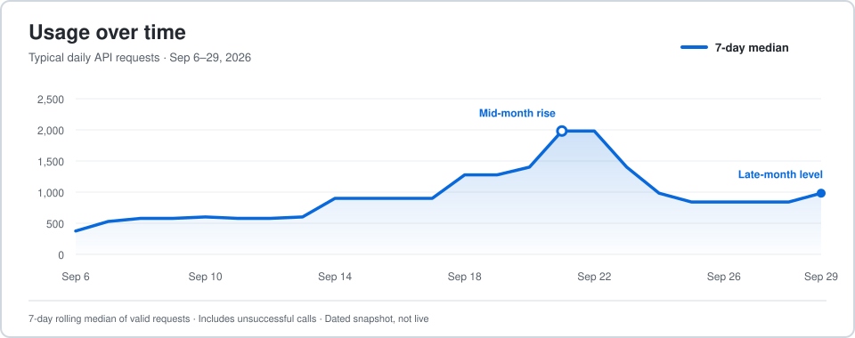

# Nexscope Ecommerce AI Tools

Practical ecommerce research, SEO, creative AI, and API workflows from the Nexscope team. This repository is a public library of guides, dated evidence, examples, and support resources for sellers and developers. The hosted Nexscope application runs separately; its source code is not in this repository.

[Explore the learning hub](https://learn.nexscope.ai/ecommerce-ai-tools/) · [Explore ecommerce tools](https://learn.nexscope.ai/tools/?utm_source=github&utm_medium=referral&utm_campaign=ecommerce_ai_tools&utm_content=readme_header) · [Browse API docs](https://www.nexscope.ai/api-docs?utm_source=github&utm_medium=referral&utm_campaign=api_docs_launch&utm_content=readme_header) · [Ask the community](https://github.com/nexscope-ai/ecommerce-ai-tools/discussions)

New users receive 1,000 free credits to get started. [Create an account](https://www.nexscope.ai/?utm_source=github&utm_medium=referral&utm_campaign=tools_launch&utm_content=readme_header). Credit use and API access vary by action and account.

## Explore ecommerce tools

Create or refine product visuals, then investigate Amazon, 1688 and TikTok Shop signals before deciding what to test.

| Your goal | Tool | What to expect |
| --- | --- | --- |
| Create product images and ad concepts | [AI Product Image Generator](https://www.nexscope.ai/tools/ai-image-generator?co-from=githubIO&utm_source=github&utm_medium=referral&utm_campaign=ai_image_generator_launch&utm_content=readme_tools) | Choose an image model and review product accuracy before publishing. |
| Turn product images into videos | [AI Video Generator](https://www.nexscope.ai/tools/ai-video-generator?co-from=githubIO&utm_source=github&utm_medium=referral&utm_campaign=ai_video_generator_launch&utm_content=readme_tools) | Upload images, choose a model and motion prompt, then preview the result. |
| Audit and optimize an Amazon listing | [AI Amazon Listing Optimizer](https://www.nexscope.ai/tools/amazon-listing-optimization-tool?co-from=githubIO&utm_source=github&utm_medium=referral&utm_campaign=amazon_listing_optimizer_launch&utm_content=readme_tools) | Review ASIN, keyword, traffic and history evidence before testing listing changes. |
| Learn from competitor complaints | [Amazon Review Analyzer](https://www.nexscope.ai/tools/amazon-review-analyzer?co-from=githubIO&utm_source=github&utm_medium=referral&utm_campaign=tools_launch&utm_content=readme_reviews) | Analyze a bounded low-star review sample and form testable product questions. |
| Find wholesale candidates from an Amazon product | [Amazon to 1688 Supplier Finder](https://learn.nexscope.ai/tools/amazon-to-1688-supplier-finder/?utm_source=github&utm_medium=referral&utm_campaign=tools_launch&utm_content=readme_1688) | Find visually similar 1688 listings, then inspect selected supplier terms and MOQ. A visual match does not prove factory identity. |
| Validate a TikTok Shop product signal | [TikTok Shop New-Product Validator](https://learn.nexscope.ai/tools/tiktok-shop-new-product-validator/?utm_source=github&utm_medium=referral&utm_campaign=tools_launch&utm_content=readme_tiktok_products) | Start from a dated ranking and compare sales windows and related video evidence for selected products. |
| Research creators connected to a product | [TikTok Shop Product-to-Creator Match](https://learn.nexscope.ai/tools/tiktok-shop-creator-match/?utm_source=github&utm_medium=referral&utm_campaign=tools_launch&utm_content=readme_tiktok_creators) | Shortlist associated creators, then inspect profiles and product-tagged videos before outreach. |
| Explore keywords and competing products | [SEO Keyword Planner](https://learn.nexscope.ai/tools/seo-keyword-planner/?utm_source=github&utm_medium=referral&utm_campaign=tools_launch&utm_content=readme_keywords) | Explore US English Google keyword metrics, Amazon US product research and an optional AI comparison report. |
| Inspect a page's SEO evidence | [Website SEO Auditor](https://www.nexscope.ai/tools/website-seo-auditor?co-from=githubIO&utm_source=github&utm_medium=referral&utm_campaign=tools_launch&utm_content=readme_auditor) | Check page-level SEO evidence and optionally request a mobile Lighthouse check. |

**[View more ecommerce tools →](https://learn.nexscope.ai/tools/?utm_source=github&utm_medium=referral&utm_campaign=tools_launch&utm_content=readme_more_tools)**

The Amazon-to-1688, TikTok Shop and SEO Keyword Planner workflows accept a visitor-provided API key; other tools may require sign-in. Credits may apply to requests you start.

## Product Gallery: get feedback on your product page

[Nexscope Product Gallery](https://learn.nexscope.ai/ecommerce-ai-tools/product-showcase/) gives sellers another public place to present a product and receive editorial suggestions. Submit a public product URL or Amazon ASIN, product details, and images; video is optional. The Nexscope team reviews submissions before publication and suggests improvements to positioning, product details, visuals, video, or destination links based on the public material provided.

**[Submit a product for review](https://learn.nexscope.ai/ecommerce-ai-tools/product-showcase/submit/?utm_source=github&utm_medium=referral&utm_campaign=product_gallery_launch&utm_content=readme_first_module)** · [Browse the Gallery](https://learn.nexscope.ai/ecommerce-ai-tools/product-showcase/) · [Discuss the workflow](https://github.com/nexscope-ai/ecommerce-ai-tools/discussions/16)

No store connection, seller token, or payment access is required. Submissions remain offline until reviewed and approved. Publication, search rankings, traffic, and sales are not guaranteed.

## About Nexscope

Nexscope helps ecommerce teams research marketplaces, analyze customer feedback, improve listings and search visibility, create product images and videos, and connect data to their own applications or AI agents through REST APIs and MCP. Sellers can use the browser tools; developers can inspect endpoint schemas, examples, and access requirements in the [API documentation](https://www.nexscope.ai/api-docs).

### Nexscope at a glance

Source: Nexscope production API usage aggregates. The line shows a seven-day rolling median of daily requests to make the underlying trend easier to read; it is not the raw daily count. The bar chart ranks APIs by request count. This is a dated snapshot, not a live counter.

## Guides and evidence

| Question | Start with |
| --- | --- |
| How can I analyze negative Amazon reviews and find product improvements? | [Review analysis guide](docs/guides/amazon-negative-review-analysis.md) and [dated case study](docs/case-studies/amazon-review-case-study.md) |
| How can I research competitor keywords? | [Amazon competitor keyword workflow](docs/guides/amazon-competitor-keyword-research.md) |
| How can I audit an ecommerce product page? | [Website SEO audit guide](docs/guides/website-seo-audit-guide.md) |
| How can I optimize an Amazon listing with evidence? | [Listing optimization guide](docs/guides/amazon-listing-optimization-tool.md) |
| How can I create accurate product images or videos? | [Image guide](docs/guides/ai-product-image-generator.md) · [Video guide](docs/guides/ai-video-generator.md) |
| How can I use ecommerce data in an AI agent? | [API selection and integration guide](docs/guides/ecommerce-api-for-ai-agents.md) · [MCP server guide](docs/guides/what-is-an-mcp-server.md) |

Browse the [API evidence library](docs/api-evidence/index.md) for dated inputs, observed outputs, credit use, and limitations, or [recent ecommerce analysis](docs/ecommerce-trends/index.md) for current industry changes.

## Build with Nexscope APIs

The [API documentation](https://www.nexscope.ai/api-docs) provides endpoint parameters, response schemas, examples, online testing, and REST/MCP guidance. Common starting points include [Amazon Reviews List](https://www.nexscope.ai/api-docs/amazon-reviews-list), [Amazon Search](https://www.nexscope.ai/api-docs/amazon-search), [1688 Search by Image](https://www.nexscope.ai/api-docs/1688-search-by-image), [Shopify Product Query](https://www.nexscope.ai/api-docs/shopify-product-query), and the [MCP tool map](https://www.nexscope.ai/mcp-map).

External REST/MCP calls and the API tester require an account API key. Creative API key access requires an active subscription; trial credits do not unlock it. Confirm each endpoint's current inputs, access requirements, credit cost, and response schema before integrating. See the [integration guide](docs/guides/api-capabilities.md) and [API examples repository](https://github.com/nexscope-ai/nexscope-ecommerce-api).

## Community and support

| Need | Where to go |
| --- | --- |
| Ask a usage or integration question | [Discussions Q&A](https://github.com/nexscope-ai/ecommerce-ai-tools/discussions/categories/q-a) |
| Suggest a workflow or feature | [Discussions Ideas](https://github.com/nexscope-ai/ecommerce-ai-tools/discussions/categories/ideas) |
| Report a reproducible bug | [Issue forms](https://github.com/nexscope-ai/ecommerce-ai-tools/issues/new/choose) |
| Share a verified workflow | [Show and tell](https://github.com/nexscope-ai/ecommerce-ai-tools/discussions/categories/show-and-tell) |
| Help shape the planned open-source store workspace | [Share your most urgent store task](https://github.com/nexscope-ai/ecommerce-ai-tools/discussions/17) |

Start with the [welcome post](https://github.com/nexscope-ai/ecommerce-ai-tools/discussions/11) and [support process](SUPPORT.md). Describe your goal, the tool or endpoint, expected behavior, and observed result. Do not post API keys, tokens, payment details, private customer data, or unredacted screenshots. For private account or billing matters, contact [service@nexscope.ai](mailto:service@nexscope.ai). To improve these public resources, see [Contributing](CONTRIBUTING.md).

Related repositories: [Nexscope Ecommerce API](https://github.com/nexscope-ai/nexscope-ecommerce-api) · [Amazon Skills](https://github.com/nexscope-ai/Amazon-Skills) · [Ecommerce SEO and GEO Skills](https://github.com/nexscope-ai/ecommerce-seo-geo-skills).

Maintained by the official Nexscope team. Amazon and Google are trademarks of their respective owners; no affiliation or endorsement is implied.
